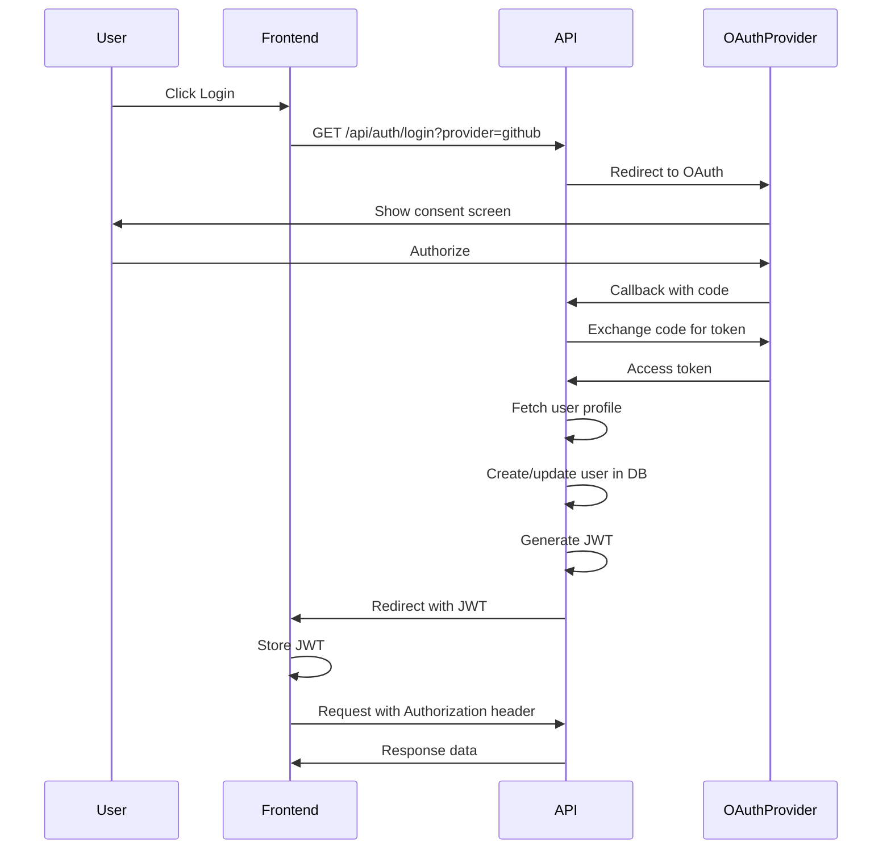

# Mission Command API Reference

Complete API documentation for the Mission Command Centre workflow orchestration system.

## Base URL

```
http://localhost:4111
```

## Authentication

All API endpoints (except OAuth endpoints) require JWT authentication. Include the bearer token in the Authorization header:

```http
Authorization: Bearer <your_jwt_token>
```

## Response Format

All endpoints return JSON responses with the following structure:

**Success Response:**
```json
{
  "success": true,
  "data": { ... }
}
```

**Error Response:**
```json
{
  "success": false,
  "error": "Error message",
  "details": { ... }
}
```

---

## Authentication Endpoints

### Login Initiate

Initiates OAuth authentication flow with GitHub or Google.

```http
GET /api/auth/login
```

**Query Parameters:**

| Parameter | Type | Required | Description |
|-----------|------|----------|-------------|
| provider | string | Yes | OAuth provider: `github` or `google` |
| redirect_uri | string | No | URL to redirect after authentication (default: `/`) |

**Example:**
```http
GET /api/auth/login?provider=github&redirect_uri=/dashboard
```

**Response:** Redirects to OAuth provider

---

### OAuth Callback

Handles OAuth callback from provider. Processes user authentication and issues JWT.

```http
GET /api/auth/callback
```

**Query Parameters:**

| Parameter | Type | Required | Description |
|-----------|------|----------|-------------|
| provider | string | Yes | OAuth provider: `github` or `google` |
| code | string | Yes | OAuth authorization code |
| state | string | Yes | CSRF protection state |

**Response:** Redirects to frontend with JWT token

---

### Logout

Invalidates current session and clears authentication.

```http
POST /api/auth/logout
```

**Authentication:** Required

**Response:**
```json
{
  "success": true,
  "message": "Logged out successfully"
}
```

---

### Get Current User

Returns information about the currently authenticated user.

```http
GET /api/auth/me
```

**Authentication:** Required

**Response:**
```json
{
  "success": true,
  "data": {
    "userId": "uuid",
    "email": "user@example.com",
    "name": "User Name",
    "role": "admin",
    "avatar_url": "https://example.com/avatar.png",
    "provider": "github"
  }
}
```

---

## Workflow Endpoints

### List Workflows

Retrieves all available workflow definitions.

```http
GET /api/workflows
```

**Authentication:** Required (Role: `viewer`)

**Response:**
```json
{
  "success": true,
  "data": {
    "workflows": {
      "workflow-id-1": {
        "id": "workflow-id-1",
        "name": "Code Review Workflow",
        "description": "Automated code review with AI agent",
        "inputSchema": { "$schema": "http://json-schema.org/..." },
        "outputSchema": { "$schema": "http://json-schema.org/..." }
      }
    }
  }
}
```

---

### Get Workflow

Retrieves a specific workflow definition.

```http
GET /api/workflows/:workflowId
```

**Authentication:** Required (Role: `viewer`)

**Path Parameters:**

| Parameter | Type | Required | Description |
|-----------|------|----------|-------------|
| workflowId | string | Yes | Workflow identifier |

**Response:**
```json
{
  "success": true,
  "data": {
    "id": "workflow-id-1",
    "name": "Code Review Workflow",
    "description": "Automated code review with AI agent",
    "inputSchema": { ... },
    "outputSchema": { ... }
  }
}
```

---

### Execute Workflow

Starts execution of a workflow with provided input data.

```http
POST /api/workflows/:workflowId/execute
```

**Authentication:** Required (Role: `operator`)

**Path Parameters:**

| Parameter | Type | Required | Description |
|-----------|------|----------|-------------|
| workflowId | string | Yes | Workflow identifier |

**Request Body:**
```json
{
  "input": {
    "repositoryUrl": "https://github.com/user/repo",
    "branch": "feature-branch"
  }
}
```

**Response:**
```json
{
  "success": true,
  "data": {
    "runId": "run-uuid",
    "status": "running",
    "startedAt": "2025-12-30T10:00:00Z"
  }
}
```

---

### Subscribe to Workflow Runs

Subscribes to Server-Sent Events (SSE) stream for workflow run updates.

```http
GET /api/workflows/:workflowId/subscribe
```

**Authentication:** Required (Role: `viewer`)

**Response:** SSE stream with workflow run events

---

## Mission (Run) Endpoints

### List Active Missions

Retrieves all currently running workflow executions.

```http
GET /api/missions/active
```

**Authentication:** Required (Role: `viewer`)

**Query Parameters:**

| Parameter | Type | Required | Description |
|-----------|------|----------|-------------|
| workflowId | string | No | Filter by workflow ID |
| limit | number | No | Max results (default: 50) |
| offset | number | No | Pagination offset (default: 0) |

**Response:**
```json
{
  "success": true,
  "data": {
    "missions": [
      {
        "runId": "run-uuid-1",
        "workflowId": "workflow-id-1",
        "workflowName": "Code Review Workflow",
        "status": "running",
        "startedAt": "2025-12-30T10:00:00Z",
        "currentStep": "analyze-code",
        "progress": 60
      }
    ],
    "total": 1
  }
}
```

---

### List Recent Missions

Retrieves recent workflow executions with optional status filtering.

```http
GET /api/missions/recent
```

**Authentication:** Required (Role: `viewer`)

**Query Parameters:**

| Parameter | Type | Required | Description |
|-----------|------|----------|-------------|
| status | string | No | Filter by status: `completed`, `failed`, `running` |
| limit | number | No | Max results (default: 20) |
| offset | number | No | Pagination offset (default: 0) |

**Response:**
```json
{
  "success": true,
  "data": {
    "missions": [
      {
        "runId": "run-uuid-1",
        "workflowId": "workflow-id-1",
        "workflowName": "Code Review Workflow",
        "status": "completed",
        "startedAt": "2025-12-30T09:00:00Z",
        "completedAt": "2025-12-30T09:15:00Z",
        "duration": 900
      }
    ],
    "total": 1
  }
}
```

---

### Get Mission Timeline

Retrieves execution timeline for a specific workflow run.

```http
GET /api/missions/:runId/timeline
```

**Authentication:** Required (Role: `viewer`)

**Path Parameters:**

| Parameter | Type | Required | Description |
|-----------|------|----------|-------------|
| runId | string | Yes | Workflow run identifier |

**Response:**
```json
{
  "success": true,
  "data": {
    "runId": "run-uuid-1",
    "workflowId": "workflow-id-1",
    "status": "completed",
    "timeline": [
      {
        "stepId": "step-1",
        "stepName": "analyze-code",
        "status": "completed",
        "startedAt": "2025-12-30T09:00:00Z",
        "completedAt": "2025-12-30T09:05:00Z",
        "duration": 300,
        "output": { "analysis": "..." }
      },
      {
        "stepId": "step-2",
        "stepName": "create-pr",
        "status": "completed",
        "startedAt": "2025-12-30T09:05:00Z",
        "completedAt": "2025-12-30T09:15:00Z",
        "duration": 600
      }
    ]
  }
}
```

---

### Get Mission Run Details

Retrieves complete details for a specific workflow run.

```http
GET /api/missions/:runId
```

**Authentication:** Required (Role: `viewer`)

**Response:**
```json
{
  "success": true,
  "data": {
    "runId": "run-uuid-1",
    "workflowId": "workflow-id-1",
    "status": "running",
    "startedAt": "2025-12-30T10:00:00Z",
    "inputData": { ... },
    "outputData": { ... },
    "currentStep": "step-2",
    "progress": 60
  }
}
```

---

## Approval Endpoints

### List Approvals

Retrieves all suspended workflow runs requiring approval with filters.

```http
GET /api/approvals
```

**Authentication:** Required (Role: `operator`)

**Query Parameters:**

| Parameter | Type | Required | Description |
|-----------|------|----------|-------------|
| workflowId | string | No | Filter by workflow ID |
| status | string | No | Filter by status: `pending`, `approved`, `declined` |
| owner | string | No | Filter by repository owner |
| repo | string | No | Filter by repository name |
| limit | number | No | Max results (default: 50) |
| offset | number | No | Pagination offset (default: 0) |

**Response:**
```json
{
  "success": true,
  "data": {
    "approvals": [
      {
        "runId": "run-uuid-1",
        "workflowId": "workflow-id-1",
        "workflowName": "Code Review Workflow",
        "suspendedAt": "2025-12-30T10:00:00Z",
        "suspendData": {
          "reason": "Awaiting PR review approval",
          "prUrl": "https://github.com/user/repo/pull/123",
          "prNumber": 123
        },
        "status": "pending",
        "priority": "high",
        "owner": "user",
        "repo": "repo",
        "prNumber": 123
      }
    ],
    "total": 1
  }
}
```

---

### Get Approval Details

Retrieves complete details for a specific approval including history.

```http
GET /api/approvals/:runId
```

**Authentication:** Required (Role: `operator`)

**Path Parameters:**

| Parameter | Type | Required | Description |
|-----------|------|----------|-------------|
| runId | string | Yes | Workflow run identifier |

**Response:**
```json
{
  "success": true,
  "data": {
    "runId": "run-uuid-1",
    "workflowId": "workflow-id-1",
    "workflowName": "Code Review Workflow",
    "suspendedAt": "2025-12-30T10:00:00Z",
    "suspendData": {
      "reason": "Awaiting PR review approval",
      "prUrl": "https://github.com/user/repo/pull/123",
      "prNumber": 123
    },
    "status": "pending",
    "history": [
      {
        "action": "suspended",
        "timestamp": "2025-12-30T10:00:00Z",
        "details": "Workflow suspended awaiting PR review"
      }
    ]
  }
}
```

---

### Approve Workflow Run

Approves a suspended workflow run and resumes execution.

```http
POST /api/approvals/:runId/approve
```

**Authentication:** Required (Role: `operator`)

**Path Parameters:**

| Parameter | Type | Required | Description |
|-----------|------|----------|-------------|
| runId | string | Yes | Workflow run identifier |

**Request Body:**
```json
{
  "feedback": "LGTM, approved",
  "prNumber": 123,
  "prUrl": "https://github.com/user/repo/pull/123"
}
```

**Response:**
```json
{
  "success": true,
  "message": "Workflow run approved and resumed",
  "data": {
    "runId": "run-uuid-1",
    "status": "running"
  }
}
```

---

### Decline Workflow Run

Declines a suspended workflow run and cancels execution.

```http
POST /api/approvals/:runId/decline
```

**Authentication:** Required (Role: `operator`)

**Path Parameters:**

| Parameter | Type | Required | Description |
|-----------|------|----------|-------------|
| runId | string | Yes | Workflow run identifier |

**Request Body:**
```json
{
  "reason": "Code quality issues need addressing"
}
```

**Response:**
```json
{
  "success": true,
  "message": "Workflow run declined",
  "data": {
    "runId": "run-uuid-1",
    "status": "declined"
  }
}
```

---

## Workflow Definition Endpoints (Admin)

### List Workflow Definitions

Retrieves all workflow definition configurations.

```http
GET /api/workflows/definitions
```

**Authentication:** Required (Role: `viewer`)

**Response:**
```json
{
  "success": true,
  "data": [
    {
      "id": "workflow-def-1",
      "name": "Code Review Workflow",
      "description": "Automated code review process",
      "inputSchema": { ... },
      "outputSchema": { ... },
      "steps": [ ... ],
      "createdBy": "user-uuid",
      "createdAt": "2025-12-01T00:00:00Z",
      "updatedAt": "2025-12-30T00:00:00Z"
    }
  ]
}
```

---

### Get Workflow Definition

Retrieves a specific workflow definition configuration.

```http
GET /api/workflows/definitions/:id
```

**Authentication:** Required (Role: `viewer`)

**Response:**
```json
{
  "success": true,
  "data": {
    "id": "workflow-def-1",
    "name": "Code Review Workflow",
    "description": "Automated code review process",
    "inputSchema": { ... },
    "outputSchema": { ... },
    "steps": [
      {
        "id": "step-1",
        "name": "analyze-code",
        "type": "execute",
        "inputSchema": { ... },
        "outputSchema": { ... }
      }
    ],
    "createdBy": "user-uuid",
    "createdAt": "2025-12-01T00:00:00Z",
    "updatedAt": "2025-12-30T00:00:00Z"
  }
}
```

---

### Create Workflow Definition

Creates a new workflow definition configuration.

```http
POST /api/workflows/definitions
```

**Authentication:** Required (Role: `admin`)

**Request Body:**
```json
{
  "name": "New Workflow",
  "description": "Workflow description",
  "inputSchema": {
    "type": "object",
    "properties": {
      "repositoryUrl": { "type": "string" }
    },
    "required": ["repositoryUrl"]
  },
  "outputSchema": {
    "type": "object",
    "properties": {
      "result": { "type": "string" }
    }
  },
  "steps": [
    {
      "id": "step-1",
      "name": "Step Name",
      "type": "execute",
      "inputSchema": { ... },
      "outputSchema": { ... }
    }
  ]
}
```

**Response:**
```json
{
  "success": true,
  "data": {
    "id": "workflow-def-new",
    "name": "New Workflow",
    "description": "Workflow description",
    "inputSchema": { ... },
    "outputSchema": { ... },
    "steps": [ ... ],
    "createdBy": "user-uuid",
    "createdAt": "2025-12-30T10:00:00Z",
    "updatedAt": "2025-12-30T10:00:00Z"
  }
}
```

---

### Update Workflow Definition

Updates an existing workflow definition configuration.

```http
PUT /api/workflows/definitions/:id
```

**Authentication:** Required (Role: `admin`)

**Request Body:**
```json
{
  "name": "Updated Workflow Name",
  "description": "Updated description",
  "steps": [ ... ]
}
```

**Response:**
```json
{
  "success": true,
  "data": {
    "id": "workflow-def-1",
    "name": "Updated Workflow Name",
    "description": "Updated description",
    "inputSchema": { ... },
    "outputSchema": { ... },
    "steps": [ ... ],
    "createdBy": "user-uuid",
    "createdAt": "2025-12-01T00:00:00Z",
    "updatedAt": "2025-12-30T10:30:00Z"
  }
}
```

---

### Delete Workflow Definition

Deletes a workflow definition configuration.

```http
DELETE /api/workflows/definitions/:id
```

**Authentication:** Required (Role: `admin`)

**Response:**
```json
{
  "success": true,
  "message": "Workflow definition deleted successfully"
}
```

---

## User Management Endpoints (Admin)

### List Users

Retrieves all users with optional filtering.

```http
GET /api/users
```

**Authentication:** Required (Role: `admin`)

**Query Parameters:**

| Parameter | Type | Required | Description |
|-----------|------|----------|-------------|
| search | string | No | Search by email or name |
| role | string | No | Filter by role: `admin`, `operator`, `viewer` |
| limit | number | No | Max results (default: 50) |
| offset | number | No | Pagination offset (default: 0) |

**Response:**
```json
{
  "success": true,
  "data": {
    "users": [
      {
        "id": "user-uuid-1",
        "email": "user@example.com",
        "name": "User Name",
        "role": "admin",
        "avatar_url": "https://example.com/avatar.png",
        "provider": "github",
        "createdAt": "2025-12-01T00:00:00Z"
      }
    ],
    "total": 1
  }
}
```

---

### Get User

Retrieves details for a specific user.

```http
GET /api/users/:id
```

**Authentication:** Required (Role: `admin`)

**Path Parameters:**

| Parameter | Type | Required | Description |
|-----------|------|----------|-------------|
| id | string | Yes | User identifier |

**Response:**
```json
{
  "success": true,
  "data": {
    "id": "user-uuid-1",
    "email": "user@example.com",
    "name": "User Name",
    "role": "admin",
    "avatar_url": "https://example.com/avatar.png",
    "provider": "github",
    "createdAt": "2025-12-01T00:00:00Z"
  }
}
```

---

### Update User

Updates user information.

```http
PUT /api/users/:id
```

**Authentication:** Required (Role: `admin`)

**Request Body:**
```json
{
  "name": "Updated Name",
  "role": "operator",
  "avatar_url": "https://example.com/new-avatar.png"
}
```

**Response:**
```json
{
  "success": true,
  "data": {
    "id": "user-uuid-1",
    "email": "user@example.com",
    "name": "Updated Name",
    "role": "operator",
    "avatar_url": "https://example.com/new-avatar.png",
    "provider": "github",
    "createdAt": "2025-12-01T00:00:00Z"
  }
}
```

---

### Delete User

Deletes a user account.

```http
DELETE /api/users/:id
```

**Authentication:** Required (Role: `admin`)

**Path Parameters:**

| Parameter | Type | Required | Description |
|-----------|------|----------|-------------|
| id | string | Yes | User identifier |

**Response:**
```json
{
  "success": true,
  "message": "User deleted successfully"
}
```

---

### List User Sessions

Retrieves all active sessions for a user.

```http
GET /api/users/:id/sessions
```

**Authentication:** Required (Role: `admin`)

**Path Parameters:**

| Parameter | Type | Required | Description |
|-----------|------|----------|-------------|
| id | string | Yes | User identifier |

**Response:**
```json
{
  "success": true,
  "data": {
    "sessions": [
      {
        "id": "session-uuid-1",
        "userId": "user-uuid-1",
        "expiresAt": "2026-01-06T10:00:00Z",
        "createdAt": "2025-12-30T10:00:00Z",
        "ipAddress": "192.168.1.1",
        "userAgent": "Mozilla/5.0..."
      }
    ]
  }
}
```

---

### Invalidate User Sessions

Invalidates all active sessions for a user.

```http
DELETE /api/users/:id/sessions
```

**Authentication:** Required (Role: `admin`)

**Response:**
```json
{
  "success": true,
  "message": "All sessions invalidated successfully"
}
```

---

### Get User Audit Log

Retrieves audit log entries for a specific user.

```http
GET /api/users/:id/audit
```

**Authentication:** Required (Role: `admin`)

**Path Parameters:**

| Parameter | Type | Required | Description |
|-----------|------|----------|-------------|
| id | string | Yes | User identifier |

**Query Parameters:**

| Parameter | Type | Required | Description |
|-----------|------|----------|-------------|
| limit | number | No | Max results (default: 100) |
| offset | number | No | Pagination offset (default: 0) |

**Response:**
```json
{
  "success": true,
  "data": {
    "auditLog": [
      {
        "id": "audit-uuid-1",
        "userId": "user-uuid-1",
        "action": "workflow_execute",
        "resourceType": "workflow",
        "resourceId": "workflow-id-1",
        "details": { ... },
        "ipAddress": "192.168.1.1",
        "createdAt": "2025-12-30T10:00:00Z"
      }
    ]
  }
}
```

---

## Audit Log Endpoints

### List Audit Logs

Retrieves audit log entries with filtering.

```http
GET /api/audit-logs
```

**Authentication:** Required (Role: `admin`)

**Query Parameters:**

| Parameter | Type | Required | Description |
|-----------|------|----------|-------------|
| userId | string | No | Filter by user ID |
| action | string | No | Filter by action type |
| resourceType | string | No | Filter by resource type |
| limit | number | No | Max results (default: 100) |
| offset | number | No | Pagination offset (default: 0) |

**Response:**
```json
{
  "success": true,
  "data": {
    "auditLogs": [
      {
        "id": "audit-uuid-1",
        "userId": "user-uuid-1",
        "action": "workflow_execute",
        "resourceType": "workflow",
        "resourceId": "workflow-id-1",
        "details": { ... },
        "ipAddress": "192.168.1.1",
        "createdAt": "2025-12-30T10:00:00Z"
      }
    ],
    "total": 1
  }
}
```

---

## GitHub Webhook Endpoints

### Webhook Handler

Processes GitHub webhook events for workflow triggers.

```http
POST /api/webhooks/github
```

**Authentication:** HMAC-SHA256 signature verification

**Headers:**

| Header | Required | Description |
|--------|----------|-------------|
| X-Hub-Signature-256 | Yes | HMAC signature for verification |
| X-GitHub-Event | Yes | Event type (e.g., `pull_request`) |

**Request Body:** GitHub webhook payload

**Response:**
```json
{
  "success": true,
  "message": "Webhook processed successfully"
}
```

---

## Error Codes

| Status Code | Description |
|-------------|-------------|
| 200 | Success |
| 201 | Created |
| 400 | Bad Request - Invalid input |
| 401 | Unauthorized - Missing or invalid token |
| 403 | Forbidden - Insufficient permissions |
| 404 | Not Found - Resource doesn't exist |
| 409 | Conflict - Resource already exists |
| 429 | Too Many Requests - Rate limit exceeded |
| 500 | Internal Server Error |

---

## Rate Limiting

API requests are rate limited per user:

- **100 requests per hour** per user
- Rate limit headers included in responses:
  - `X-RateLimit-Limit`: Total requests allowed
  - `X-RateLimit-Remaining`: Remaining requests
  - `X-RateLimit-Reset`: Unix timestamp when limit resets

**Rate Limit Exceeded Response:**
```json
{
  "success": false,
  "error": "Rate limit exceeded",
  "details": {
    "limit": 100,
    "remaining": 0,
    "resetAt": 1735584000
  }
}
```

---

## Data Types

### User Object

```typescript
interface MissionCommandUser {
  userId: string;
  email: string;
  name?: string;
  avatar_url?: string;
  role: 'admin' | 'operator' | 'viewer';
  provider: 'github' | 'google';
  createdAt?: string;
}
```

### Workflow Object

```typescript
interface Workflow {
  id: string;
  name: string;
  description?: string;
  inputSchema: JSONSchema;
  outputSchema: JSONSchema;
}
```

### Mission Run Object

```typescript
interface MissionRun {
  runId: string;
  workflowId: string;
  workflowName: string;
  status: 'running' | 'completed' | 'failed';
  startedAt: string;
  completedAt?: string;
  currentStep?: string;
  progress?: number;
  duration?: number;
  inputData?: any;
  outputData?: any;
}
```

### Approval Entry Object

```typescript
interface ApprovalEntry {
  runId: string;
  workflowId: string;
  workflowName: string;
  suspendedAt: string;
  suspendData: SuspendData;
  status: 'pending' | 'approved' | 'declined';
  priority?: 'low' | 'normal' | 'high';
  owner?: string;
  repo?: string;
  prNumber?: number;
}
```

---

## WebSocket/SSE Events

### Workflow Run Events (SSE)

Server-Sent Events stream for real-time workflow updates:

```typescript
interface WorkflowEvent {
  type: 'run_started' | 'run_completed' | 'run_failed' | 'step_started' | 'step_completed';
  runId: string;
  workflowId: string;
  timestamp: string;
  data?: any;
}
```

---

## SDK Client Usage

### JavaScript/TypeScript

```typescript
import { MastraClient } from '@mastra/react';

const client = new MastraClient({
  baseUrl: 'http://localhost:4111',
  getToken: () => localStorage.getItem('jwt_token')
});

// List workflows
const workflows = await client.listWorkflows();

// Execute workflow
const run = await client.executeWorkflow('workflow-id', {
  repositoryUrl: 'https://github.com/user/repo'
});

// Get approvals
const approvals = await client.listApprovals({ status: 'pending' });
```

---

## Authentication Flow



---

## Examples

See `examples/` directory for complete integration examples:

- **Basic Workflow Execution**: Execute and monitor workflows
- **Approval Handling**: Create approval queues and process approvals
- **User Management**: Admin user management operations
- **Webhook Integration**: GitHub webhook setup and handling
